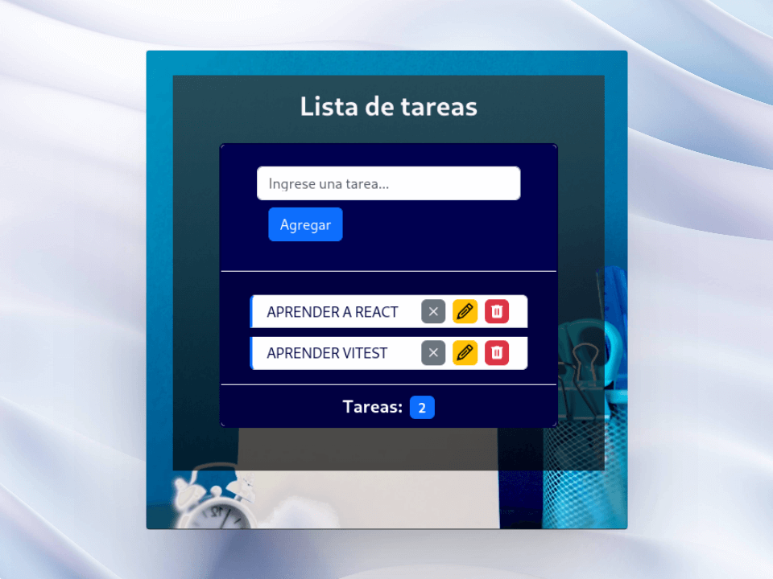

# ⚙️Trabajo Práctico Integrador 📑

# ⚙️Trabajo Práctico Integrador 📑

**Aplicación web que permite gestionar una lista de tareas utilizando**:

- Componentes funcionales.
- Hook useState para el manejo del estado.
- Hook useEffect para realizar efectos secundarios, y eventos para interactuar con el usuario

[Despleglado en Vercel: rama **main**](https://final-equipoq.vercel.app/)

## Ideas de implementación para mejorar la app:

- **Filtrar y Buscar Tareas**: Implementar opciones de filtrado para mostrar tareas completadas, no completadas o todas. Agregar un campo de búsqueda para permitir a los usuarios encontrar tareas específicas más fácilmente.
- **Prioridades y Fechas de Vencimiento**: Permitir a los usuarios establecer prioridades para las tareas (por ejemplo, baja, media, alta). Agregar la opción de asignar fechas de vencimiento a las tareas.
- **Notificaciones**: Implementar notificaciones para recordar a los usuarios sobre tareas pendientes o fechas de vencimiento cercanas.
- **Arrastrar y Soltar**: Agregar la capacidad de reorganizar tareas mediante la funcionalidad de arrastrar y soltar.
- **Comentarios y Notas**: Permitir a los usuarios agregar comentarios o notas a cada tarea.
- **Usuarios Autenticados**: Implementa la autenticación de usuarios para que puedan tener cuentas individuales y guardar sus tareas de manera personalizada.
- **Sincronización en Tiempo Real**: Si se decide implementar la autenticación de usuarios, se podría agregar la sincronización en tiempo real para que los cambios realizados por un usuario se reflejen inmediatamente para otros colaboradores.
- **Historial de Tareas**: Agregar un historial que registre las acciones realizadas en cada tarea, como cambios de estado, ediciones, etc.
- **Estadísticas y Gráficos**: Proporcionar estadísticas visuales sobre el progreso de las tareas, como la cantidad de tareas completadas en un período de tiempo determinado.
- **Interfaz de Usuario Mejorada**: Mejorar la interfaz de usuario con detalles visuales, animaciones y transiciones para una experiencia de usuario más agradable.
- **Modo Oscuro**: Agregar la opción de cambiar entre el modo claro y oscuro para mejorar la accesibilidad y la comodidad visual.
